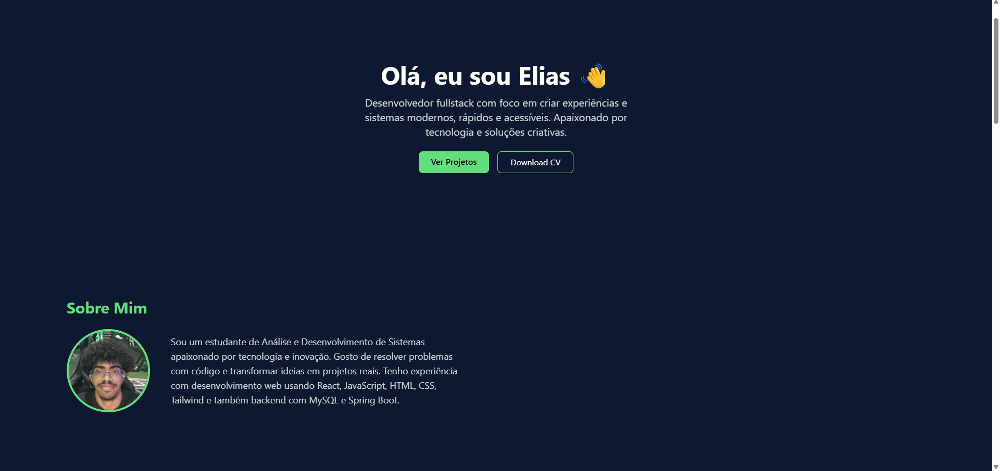

# Portfólio Pessoal - Elias

Este é meu portfólio pessoal desenvolvido com **React**, **Tailwind CSS** e **Firebase**. Nele apresento minhas habilidades, projetos, e um sistema de feedback interativo.

---

## 🔗 Acesse Online

🌐 [https://eliasdev-portfolio.vercel.app/](https://eliasdev-portfolio.vercel.app/)

---

## 🛠️ Tecnologias Utilizadas

- [React](https://reactjs.org/)
- [Tailwind CSS](https://tailwindcss.com/)
- [Firebase (Firestore)](https://firebase.google.com/)
- [Vite](https://vitejs.dev/) – para build e desenvolvimento
- [React Icons](https://react-icons.github.io/react-icons/) – para os ícones de habilidades

---

## 📂 Funcionalidades

- Página principal com apresentação pessoal
- Seção com habilidades (React, JavaScript, Java, Python, etc)
- Formulário de feedback com integração ao Firestore
- Lista de feedbacks que se atualiza em tempo real
- Estilização com Tailwind responsiva
- Deploy via Vercel

